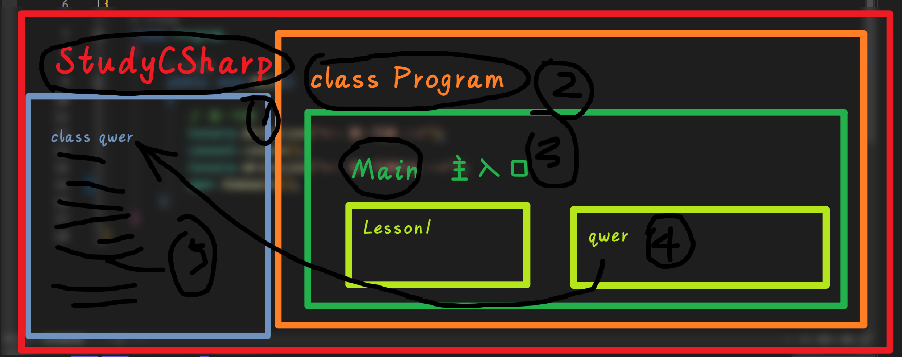

# 程序运行逻辑

1. namespace 命名空间只能有一个
2. class 类可以有多个
3. Main 作为程序的入口，在同一个命名空间下**只能有一个**
4. 方法可以有多个


# 数据类型转换
## 一，隐式类型转换

``` CSharp
int a = 10;
float b = a;
```

解释：一种数据类型，只要其取值范围完全包含在另外一种数据类型总，那么就可以隐式类型转换

## 二， 显式类型转换

> 又名“强制类型转换”

### 2.1 数值的转换
```C#
using System;

namespace Test{
    class Program {
        static void Main(string[] args) {
            float d = 5673.74f;
            int i;
        
            // 将 float 类型转换为 int
            i = (int)d;
            Console.WriteLine("转换前{0}，转换后{1}", d, i);
            Console.ReadKey();
            // 转换前5673.74，转换后5673
        }
    }
}
```

### 2.2 字符串
```C#
using System;

namespace Test{
    class Program {
        static void Main(string[] args) {
            int i = 75;
            float f = 53.005;
            bool b = true;

            Console.WriteLine(i.ToString()); // "75"
            Console.WriteLine(f.ToString()); // "53.005"
            Console.WriteLine(b.ToString()); // "True"
            Console.ReadKey();
        }
    }
}
```

### 2.3 bool 类型转换
```C#
int i1 = 1;
int i2 = 0;
bool b1 = Convert.ToBoolean(i1);
bool b2 = Convert.ToBoolean(i2);
Console.WriteLine(b1); // 输出: True
Console.WriteLine(b2); // 输出: False
```

### 2.4 时间
```C#
using System;
public class ConversionToDateTime
{
	public static void Main()
	{
		string dateString = "2020-04-21 15:57:32";
		DateTime date = Convert.ToDateTime(dateString);
		Console.WriteLine(date); // 输出: "2020/4/21 15:57:32"
	}
}
```

### 2.5 总结：

| 方法                             | 描述                                    |
| ------------------------------ | ------------------------------------- |
| ToString                       | 将类型转换为字符串类型                           |
| (int)d                         | 将数值类型转换为整数                            |
| (float)i                       | 将数值类型转换为浮点                            |
| Convert.ToBoolean(int)         | 将数值类型转换为bool类型（只有0和1才行）               |
| Convert.ToDateTime(dateString) | 将固定时间格式转换为不同时间格式 "2020/4/21 15:57:32" |
# 三，算术运算符

### 3.1 概述
*下面的实例 A=10，B=20*

| 运算符 | 描述                        | 实例           |
| --- | ------------------------- | ------------ |
| +   | 加法运算符，对运算符左右两边的操作数执行加法操作  | A + B 值为 30  |
| -   | 减法运算符，对运算符左右两边的操作数执行减法操作  | A - B 值为 -10 |
| *   | 乘法运算符，将运算符左右两边的操作数相乘      | A * B 值为 200 |
| /   | 除法运算符，使用运算符左边的操作数除以右边的操作数 | B / A 值为 2   |
| %   | 取模运算符，整除后的余数              | B % A 值为 0   |
| ++  | 自增运算符，整数值增加 1             | A++ 值为 11    |
| --  | 自减运算符，整数值减少 1             | A-- 值为 9     |

### 3.2 示例
```C#
using System;

namespace c.biancheng.net
{
    class Demo
    {
        static void Main()
        {
            int a = 10;
            int b = 20;
            
            Console.WriteLine("a + b = {0}", a + b);
            Console.WriteLine("a - b = {0}", a - b);
            Console.WriteLine("a * b = {0}", a * b);
            Console.WriteLine("a / b = {0}", a / b);
            Console.WriteLine("a % b = {0}", a % b);
            Console.WriteLine("++a 的值是 {0}", ++a);
            a = 10; // 重新给变量 a 赋值
            Console.WriteLine("a-- 的值是 {0}", a--);
            Console.WriteLine("a 的值是 {0}", a);
            Console.ReadLine();
            /*
            结果：
            a + b = 30  
			a - b = -10  
			a * b = 200  
			a / b = 0  
			a % b = 10  
			++a 的值是 11  
			a-- 的值是 10  
			a 的值是 9
            */
        }
    }
}
```

